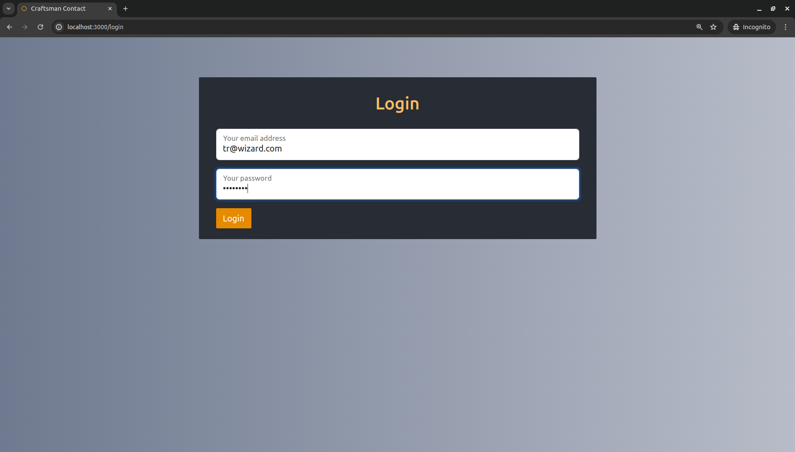

<a name="readme-top"></a>

# Craftsman Contact


### About

This full-stack application was made with the intension to contact different kinds of craftspeople and clients-to-be. Users can register with their name, phone number and email address, they can offer services (if they want to) or simply look for a service provider by profession. A client can request a service by initiating a 'Deal', the addressee craftspeople can accept it. Both parties can close the ongoing 'Deal'.

The application includes user authentication and authorization, and allows admins to manage users and their services.


### Project structure

#### Backend

- Framework: .NET 8.0
- Key technologies: ASP.NET Core, Entity Framework Core, Identity, JWT Authentication 

#### Frontend

- Framework: React 18.2
- Key technologies: React Router, React Bootstrap

#### Testing

- Unit tests: NUnit, Moq
- Integration tests: xUnit
- CI: GitHub Actions Workflow

<p align="right">(<a href="#readme-top">back to top</a>)</p>

### Installation

#### Prerequisites

- .NET 8.0 SDK
- Node.j (20.12 or later) and npm (10.5 or later)
- SQL Server

#### Backend setup

1.  Clone the repository: 

   `git clone https://github.com/EviBera/CraftsmanContact.git`

   `cd CraftsmanContact/CraftsmanContact`

2. Configure the database connection string in `appsettings.json`:

   ```
   "ConnectionStrings": {
     "DefaultConnectionString": "Server=localhost,1433;Database=CraftsmanContact;User Id=sa;Password=yourStrong(!)Password;TrustServerCertificate=True"
   }
   ```

3. Set environment variables for JWT and Admin settings:

   - Create a `.env` file in the project root: `touch .env`

   - Add the following variables to the `.env` file:

     `JWT_ISSUER=http://localhost:5213
     JWT_AUDIENCE=http://localhost:5213
     JWT_SIGNINGKEY=your_jwt_signing_key
     ADMIN_EMAIL=admin@admin.com
     ADMIN_FIRSTNAME=CC
     ADMIN_LASTNAME=Admin
     ADMIN_PHONENUMBER=any_phone_number
     ADMIN_PASSWORD=Admin123!`

4. Add and run database migrations to create schemas: 

   - Add migration: `dotnet ef migrations add InitialCreate`
   - Update database: `dotnet ef database update`

5. Run the application: `dotnet run`

#### Frontend setup

1. Navigate to the frontend directory: `cd ../frontend`

2. Install dependencies: `npm install`

3. Modify the `sample.env` file or create a `.env` file in the project root with content:

   `REACT_APP_BASE_URL="http://localhost:5213/api"`

4. Run the application: `npm start`


<p align="right">(<a href="#readme-top">back to top</a>)</p>

### Usage

Landing page:


<p align="right">(<a href="#readme-top">back to top</a>)</p>

The application shows limited data if someone uses it without registration, so it is worth registering:


<p align="right">(<a href="#readme-top">back to top</a>)</p>

After the registration the user can log in.



<p align="right">(<a href="#readme-top">back to top</a>)</p>

After the logging procedure the user is welcomed.


<p align="right">(<a href="#readme-top">back to top</a>)</p>

Moving the cursor above the orange section the offered services become visible, the service description is also visible on hover.


<p align="right">(<a href="#readme-top">back to top</a>)</p>

Clicking on the service name the craftspeople offering this service are displayed.


<p align="right">(<a href="#readme-top">back to top</a>)</p>

The user can choose a craftsperson, clicking the 'Contact' button shows up a confirmation card with two options: cancel or send a deal request to the addressee.


<p align="right">(<a href="#readme-top">back to top</a>)</p>

As a result the deal request is displayed in 'My deals' section, the user can check it with clicking the link.


<p align="right">(<a href="#readme-top">back to top</a>)</p>

Users can register a service from the given list or remove one if they do not want to offer it in the future. They have to visit 'My services' page for this. (Only an Admin can add brand new services to the list. This feature works only on the backend at this moment.)


<p align="right">(<a href="#readme-top">back to top</a>)</p>

A simple tick is enough for regular users.


<p align="right">(<a href="#readme-top">back to top</a>)</p>

After submitting comes the confirmation.


If the user finished they can log out with one click.

<p align="right">(<a href="#readme-top">back to top</a>)</p>

On the craftsman side the request is also visible.


<p align="right">(<a href="#readme-top">back to top</a>)</p>

Clicking the number in the 'No.' column the details can be seen. Here the craftsperson can accept the request. Both the provider and the client can close the deal on this card on his/her own page.


<p align="right">(<a href="#readme-top">back to top</a>)</p>


### Contact

Éva Bera - beraevi@gmail.com

Project link: https://github.com/EviBera/CraftsmanContact